# ImageMonitor クラス図

## アーキテクチャ概要クラス図

```mermaid
classDiagram
    %% Main Application Entry Point
    class App {
        +IHost AppHost
        +ShutdownMode ShutdownMode
        +OnStartup()
        +ConfigureServices()
        +OnExit()
    }
    
    %% Main Window and UI
    class MainWindow {
        +MainViewModel ViewModel
        +LoadWindowStateAsync()
        +Settings_Click()
        +Exit_Click()
        +OptimizeDatabase_Click()
        +About_Click()
        +ClearSearch_Click()
        +SearchTextBox_KeyDown()
        +Properties_Click()
    }
    
    class SettingsWindow {
        +SettingsViewModel ViewModel
        +SaveSettings_Click()
        +Cancel_Click()
        +AddDirectory_Click()
        +RemoveDirectory_Click()
    }
    
    %% ViewModels (MVVM Pattern)
    class MainViewModel {
        +ObservableCollection~IDisplayItem~ DisplayItems
        +IDisplayItem SelectedDisplayItem
        +string SearchQuery
        +int ThumbnailSize
        +string StatusText
        +int TotalItems
        +bool IsPropertiesPanelVisible
        +SortBy SortBy
        +SortDirection SortDirection
        +ICommand SearchImagesCommand
        +ICommand RefreshCommand
        +ICommand ScanImagesCommand
        +ICommand OpenImageCommand
        +ICommand OpenFolderCommand
        +ICommand ToggleSortDirectionCommand
        +LoadImageItemsAsync()
        +LoadRemainingItemsAsync()
        +SearchImagesAsync()
        +OpenImageAsync()
        +OpenFolderAsync()
        -Dictionary~string,IEnumerable~ArchiveItem~~ _searchCache
        -ApplyUILevelSort(IEnumerable~IDisplayItem~)
    }
    
    class SettingsViewModel {
        +ObservableCollection~string~ ScanDirectories
        +int ThumbnailSize
        +string DefaultArchiveViewer
        +int Theme
        +List~string~ SupportedImageFormats
        +List~string~ SupportedArchiveFormats
        +bool GenerateArchiveThumbnails
        +int MaxArchiveEntries
        +int MaxConcurrentScans
        +int ScanTimeout
        +ICommand AddDirectoryCommand
        +ICommand RemoveDirectoryCommand
        +LoadSettingsAsync()
        +SaveSettingsAsync()
    }
    
    %% Models
    class ImageItem {
        +string Id
        +string FilePath
        +string FileName
        +long FileSize
        +DateTime CreatedAt
        +DateTime ModifiedAt
        +int Width
        +int Height
        +string ImageFormat
        +string ThumbnailPath
        +bool IsArchived
        +string ArchivePath
        +DateTime? DateTaken
        +bool HasExifData
        +string Hash
        +string DisplayName
        +string Resolution
        +string FormattedFileSize
    }
    
    class ArchiveItem {
        +string Id
        +string FilePath
        +string FileName
        +long FileSize
        +DateTime CreatedAt
        +DateTime ModifiedAt
        +int ImageFiles
        +string ThumbnailPath
        +string Hash
        +string DisplayName
        +string Resolution
        +string FormattedFileSize
    }
    
    class ScanHistory {
        +string Id
        +DateTime ScanStartTime
        +DateTime? ScanEndTime
        +int TotalFilesScanned
        +int NewFilesAdded
        +int UpdatedFiles
        +int ErrorCount
        +string ScanPath
        +string Status
    }
    
    class AppSettings {
        +List~string~ ScanDirectories
        +int ThumbnailSize
        +string DefaultArchiveViewer
        +int Theme
        +List~string~ SupportedImageFormats
        +List~string~ SupportedArchiveFormats
        +bool GenerateArchiveThumbnails
        +int MaxArchiveEntries
        +double WindowWidth
        +double WindowHeight
        +bool WindowMaximized
        +int MaxConcurrentScans
        +int ScanTimeout
        +int ThumbnailCacheSize
        +int CacheCleanupInterval
        +bool EnableThumbnailGeneration
        +bool EnableLogging
        +string LogLevel
        +int MaxLogFiles
    }
    
    class SearchFilter {
        +string Query
        +long? MinFileSize
        +long? MaxFileSize
        +DateTime? DateFrom
        +DateTime? DateTo
        +int? MinWidth
        +int? MaxWidth
        +int? MinHeight
        +int? MaxHeight
        +bool IncludeArchives
        +double ImageRatioThreshold
        +List~string~ ImageFormats
        +bool? HasExifData
        +DateTime? DateTakenFrom
        +DateTime? DateTakenTo
        +SortBy SortBy
        +SortDirection SortDirection
        +int PageSize
        +int PageNumber
    }
    
    %% Interfaces
    class IDisplayItem {
        <<interface>>
        +string Id
        +string FilePath
        +string FileName
        +long FileSize
        +DateTime CreatedAt
        +DateTime ModifiedAt
        +string ThumbnailPath
        +string DisplayName
        +string Resolution
        +string FormattedFileSize
    }
    
    %% Services
    class IDatabaseService {
        <<interface>>
        +InitializeDatabaseAsync()
        +AddImageItemAsync(ImageItem)
        +AddArchiveItemAsync(ArchiveItem)
        +GetImageItemsAsync(int, int)
        +GetArchiveItemsAsync(int, int)
        +SearchImageItemsAsync(SearchFilter)
        +SearchArchiveItemsAsync(SearchFilter)
        +UpdateImageItemAsync(ImageItem)
        +UpdateArchiveItemAsync(ArchiveItem)
        +DeleteImageItemAsync(string)
        +DeleteArchiveItemAsync(string)
        +GetTotalCountAsync()
        +OptimizeDatabaseAsync()
    }
    
    class DatabaseService {
        -LiteDatabase _database
        -ILogger~DatabaseService~ _logger
        +InitializeDatabaseAsync()
        +AddImageItemAsync(ImageItem)
        +AddArchiveItemAsync(ArchiveItem)
        +GetImageItemsAsync(int, int)
        +GetArchiveItemsAsync(int, int)
        +SearchImageItemsAsync(SearchFilter)
        +SearchArchiveItemsAsync(SearchFilter)
        +UpdateImageItemAsync(ImageItem)
        +UpdateArchiveItemAsync(ArchiveItem)
        +DeleteImageItemAsync(string)
        +DeleteArchiveItemAsync(string)
        +GetTotalCountAsync()
        +OptimizeDatabaseAsync()
        -ApplySearchFilter(ILiteQueryable, SearchFilter)
        -CreateIndexes()
    }
    
    class IConfigurationService {
        <<interface>>
        +GetSettingsAsync()
        +SaveSettingsAsync(AppSettings)
    }
    
    class ConfigurationService {
        -string _settingsFilePath
        -ILogger~ConfigurationService~ _logger
        +GetSettingsAsync()
        +SaveSettingsAsync(AppSettings)
        -GetDefaultSettings()
    }
    
    class IImageScanService {
        <<interface>>
        +ScanDirectoriesAsync(List~string~)
        +ScanDirectoryAsync(string)
    }
    
    class ImageScanService {
        -IDatabaseService _databaseService
        -IThumbnailService _thumbnailService
        -IConfigurationService _configurationService
        -ILogger~ImageScanService~ _logger
        +ScanDirectoriesAsync(List~string~)
        +ScanDirectoryAsync(string)
        -ProcessImageFileAsync(string)
        -ProcessArchiveFileAsync(string)
        -IsImageFile(string)
        -IsArchiveFile(string)
    }
    
    class IThumbnailService {
        <<interface>>
        +GenerateThumbnailAsync(string, int)
        +GenerateArchiveThumbnailAsync(string, int)
        +GetThumbnailPathAsync(string, int)
    }
    
    class ThumbnailService {
        -string _thumbnailCacheDirectory
        -ILogger~ThumbnailService~ _logger
        -IConfigurationService _configService
        -SemaphoreSlim _operationLock
        -ConcurrentDictionary _pendingThumbnails
        -ConcurrentDictionary _thumbnailCache
        +GenerateThumbnailAsync(string, int)
        +GenerateArchiveThumbnailAsync(string, int)
        +GetThumbnailPathAsync(string, int)
        -CreateThumbnailDirectory(int)
        -GenerateThumbnailInternalAsync(string, string, int)
        -GenerateThumbnailFromStreamAsync(Stream, string, int, string)
        -GenerateZipThumbnailAsync(string, string, int)
        -GenerateRarThumbnailAsync(string, string, int)
        -ExtractArchiveImage(string)
    }
    
    class LauncherService {
        -ILogger~LauncherService~ _logger
        +LaunchAssociatedAppAsync(string)
        +OpenFolderAndSelectFileAsync(string)
    }
    
    class IMessagingService {
        <<interface>>
        +ShowMessageAsync(string, string, MessageType)
        +ShowConfirmationAsync(string, string)
    }
    
    class MessagingService {
        +ShowMessageAsync(string, string, MessageType)
        +ShowConfirmationAsync(string, string)
    }
    
    %% Converters
    class ThumbnailSizeToCardSizeConverter {
        +Convert(object, Type, object, CultureInfo)
        +ConvertBack(object, Type, object, CultureInfo)
    }
    
    %% Enums
    class SortBy {
        <<enumeration>>
        FileName
        FileSize
        CreatedAt
        ModifiedAt
        Width
        Height
    }
    
    class SortDirection {
        <<enumeration>>
        Ascending
        Descending
    }
    
    class MessageType {
        <<enumeration>>
        Information
        Warning
        Error
        Question
    }
    
    %% Relationships
    App --> MainWindow : creates
    App --> IConfigurationService : uses
    App --> IDatabaseService : uses
    
    MainWindow --> MainViewModel : binds
    SettingsWindow --> SettingsViewModel : binds
    
    MainViewModel --> IDatabaseService : uses
    MainViewModel --> IImageScanService : uses
    MainViewModel --> LauncherService : uses
    MainViewModel --> IMessagingService : uses
    MainViewModel --> IDisplayItem : manages
    
    SettingsViewModel --> IConfigurationService : uses
    
    DatabaseService ..|> IDatabaseService : implements
    ConfigurationService ..|> IConfigurationService : implements
    ImageScanService ..|> IImageScanService : implements
    ThumbnailService ..|> IThumbnailService : implements
    MessagingService ..|> IMessagingService : implements
    
    ImageItem ..|> IDisplayItem : implements
    ArchiveItem ..|> IDisplayItem : implements
    
    ImageScanService --> IDatabaseService : uses
    ImageScanService --> IThumbnailService : uses
    ImageScanService --> IConfigurationService : uses
    
    MainViewModel --> SearchFilter : creates
    DatabaseService --> ImageItem : manages
    DatabaseService --> ArchiveItem : manages
    DatabaseService --> ScanHistory : manages
    
    ConfigurationService --> AppSettings : manages
```

## 主要コンポーネントの責務

### 1. Presentation Layer (UI)
- **MainWindow**: メインウィンドウのUI制御
- **SettingsWindow**: 設定画面のUI制御
- **MainViewModel**: メイン画面のビジネスロジック
- **SettingsViewModel**: 設定画面のビジネスロジック

### 2. Service Layer (ビジネスロジック)
- **DatabaseService**: データベース操作の実装
- **ConfigurationService**: 設定ファイルの管理
- **ImageScanService**: 画像・アーカイブファイルのスキャン
- **ThumbnailService**: サムネイル画像の生成・管理
- **LauncherService**: 外部アプリケーションの起動
- **MessagingService**: メッセージ表示の管理

### 3. Model Layer (データモデル)
- **ImageItem**: 画像ファイルの情報
- **ArchiveItem**: アーカイブファイルの情報
- **ScanHistory**: スキャン履歴
- **AppSettings**: アプリケーション設定
- **SearchFilter**: 検索条件

### 4. Infrastructure Layer
- **IDisplayItem**: 表示アイテムの共通インターフェース
- **ThumbnailSizeToCardSizeConverter**: WPF用の値コンバーター

## 検索機能のクラス相互作用

## 依存性注入の構成

## WebPサポート追加による主要クラス変更（2025-09-07）

### 変更されたクラス

1. **ThumbnailService**：
   - `GenerateThumbnailFromStreamAsync`メソッドに`fileExtension`パラメータを追加
   - WebP用の例外ハンドリング（NotSupportedException, FileFormatException）を実装
   - ZIP/RAR処理でのファイル拡張子取得・伝達の強化

2. **MainViewModel**：
   - `LoadRemainingItemsAsync`メソッドの追加（バックグラウンド読み込み）
   - `ApplyUILevelSort`プライベートメソッドの追加（UIレベルソート）
   - 検索結果キャッシュ機能の強化

3. **App**：
   - `ShutdownMode`プロパティの管理追加
   - 重複ウィンドウ表示問題の修正

4. **AppSettings**：
   - `SupportedImageFormats`にWebP形式（.webp）を追加

### 削除されたクラス・メソッド
- なし（既存機能はすべて保持、拡張のみ）

### 新しい依存関係
- ThumbnailService → ファイル拡張子情報（アーカイブエントリから）
- MainViewModel → UIレベルソート機能
- 既存の依存関係は変更なし