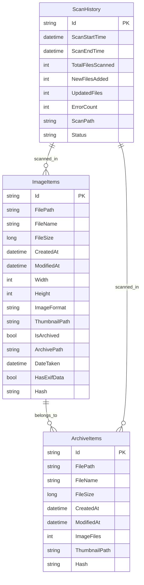

# ImageMonitor 技術仕様書

## 概要
ImageMonitorは、画像ファイルおよびアーカイブファイル（ZIP、RAR）を管理・閲覧するためのWPFアプリケーションです。

## バージョン情報
- **バージョン**: 1.0.0
- **フレームワーク**: .NET 8 (net8.0-windows)
- **UI**: WPF (Windows Presentation Foundation)
- **データベース**: LiteDB
- **ログ**: Serilog

## アーキテクチャ

### 全体構成
```
ImageMonitor/
├── src/ImageMonitor/           # メインアプリケーション
│   ├── Models/                 # データモデル
│   ├── Services/              # ビジネスロジック層
│   ├── ViewModels/            # MVVM ビューモデル
│   ├── Views/                 # XAML ビュー
│   └── Converters/            # 値コンバーター
├── build/net8.0-windows/      # ビルド出力
└── docs/                      # ドキュメント
```

### 設計パターン
- **MVVM (Model-View-ViewModel)**: WPFの標準的な設計パターン
- **Dependency Injection**: Microsoft.Extensions.DependencyInjection
- **Repository Pattern**: データアクセス層の抽象化
- **Command Pattern**: UI操作の抽象化

## データベース構造 (ER図)



## データ構造仕様書

### Models

#### 1. ImageItem
画像ファイルの情報を格納するモデル

| プロパティ | 型 | 説明 | 必須 |
|-----------|---|------|------|
| Id | string | 一意識別子 (GUID) | ○ |
| FilePath | string | ファイルの完全パス | ○ |
| FileName | string | ファイル名 | ○ |
| FileSize | long | ファイルサイズ (バイト) | ○ |
| CreatedAt | DateTime | 作成日時 | ○ |
| ModifiedAt | DateTime | 更新日時 | ○ |
| Width | int | 画像の幅 (ピクセル) | - |
| Height | int | 画像の高さ (ピクセル) | - |
| ImageFormat | string | 画像形式 (.jpg, .png等) | - |
| ThumbnailPath | string | サムネイルファイルパス | - |
| IsArchived | bool | アーカイブ内かどうか | ○ |
| ArchivePath | string | アーカイブファイルパス | - |
| DateTaken | DateTime? | 撮影日時 (EXIF) | - |
| HasExifData | bool | EXIF データの有無 | ○ |
| Hash | string | ファイルハッシュ値 | - |

#### 2. ArchiveItem
アーカイブファイル（ZIP、RAR）の情報を格納するモデル

| プロパティ | 型 | 説明 | 必須 |
|-----------|---|------|------|
| Id | string | 一意識別子 (GUID) | ○ |
| FilePath | string | アーカイブファイルの完全パス | ○ |
| FileName | string | アーカイブファイル名 | ○ |
| FileSize | long | ファイルサイズ (バイト) | ○ |
| CreatedAt | DateTime | 作成日時 | ○ |
| ModifiedAt | DateTime | 更新日時 | ○ |
| ImageFiles | int | 含まれる画像ファイル数 | ○ |
| ThumbnailPath | string | サムネイルファイルパス | - |
| Hash | string | ファイルハッシュ値 | - |

#### 3. ScanHistory
スキャン履歴を格納するモデル

| プロパティ | 型 | 説明 | 必須 |
|-----------|---|------|------|
| Id | string | 一意識別子 (GUID) | ○ |
| ScanStartTime | DateTime | スキャン開始時刻 | ○ |
| ScanEndTime | DateTime? | スキャン終了時刻 | - |
| TotalFilesScanned | int | スキャンしたファイル総数 | ○ |
| NewFilesAdded | int | 新規追加ファイル数 | ○ |
| UpdatedFiles | int | 更新されたファイル数 | ○ |
| ErrorCount | int | エラー発生件数 | ○ |
| ScanPath | string | スキャン対象パス | ○ |
| Status | string | スキャン状態 (Running, Completed, Error) | ○ |

#### 4. AppSettings
アプリケーション設定を格納するモデル

| プロパティ | 型 | 説明 | デフォルト値 |
|-----------|---|------|-------------|
| ScanDirectories | List&lt;string&gt; | スキャン対象ディレクトリ | 空リスト |
| ThumbnailSize | int | サムネイルサイズ | 192 |
| DefaultArchiveViewer | string | デフォルトアーカイブビューアー | null |
| Theme | int | テーマ設定 | 0 |
| SupportedImageFormats | List&lt;string&gt; | サポート画像形式 | [".jpg", ".jpeg", ".png"] |
| SupportedArchiveFormats | List&lt;string&gt; | サポートアーカイブ形式 | [".zip", ".rar"] |
| GenerateArchiveThumbnails | bool | アーカイブサムネイル生成 | true |
| MaxArchiveEntries | int | アーカイブ最大エントリ数 | 10000 |
| WindowWidth | double | ウィンドウ幅 | 1200 |
| WindowHeight | double | ウィンドウ高さ | 800 |
| WindowMaximized | bool | ウィンドウ最大化状態 | false |
| MaxConcurrentScans | int | 最大並行スキャン数 | 4 |
| ScanTimeout | int | スキャンタイムアウト(秒) | 300 |
| ThumbnailCacheSize | int | サムネイルキャッシュサイズ | 1000 |
| CacheCleanupInterval | int | キャッシュクリーンアップ間隔(時間) | 24 |
| EnableThumbnailGeneration | bool | サムネイル生成有効 | true |
| EnableLogging | bool | ログ記録有効 | true |
| LogLevel | string | ログレベル | "Information" |
| MaxLogFiles | int | 最大ログファイル数 | 7 |

#### 5. SearchFilter
検索フィルター条件を格納するモデル

| プロパティ | 型 | 説明 |
|-----------|---|------|
| Query | string | 検索クエリ文字列 |
| MinFileSize | long? | 最小ファイルサイズ |
| MaxFileSize | long? | 最大ファイルサイズ |
| DateFrom | DateTime? | 開始日時 |
| DateTo | DateTime? | 終了日時 |
| MinWidth | int? | 最小幅 |
| MaxWidth | int? | 最大幅 |
| MinHeight | int? | 最小高さ |
| MaxHeight | int? | 最大高さ |
| IncludeArchives | bool | アーカイブを含むか |
| ImageRatioThreshold | double | 画像比率閾値 |
| ImageFormats | List&lt;string&gt; | 対象画像形式 |
| HasExifData | bool? | EXIF データの有無 |
| DateTakenFrom | DateTime? | 撮影日開始 |
| DateTakenTo | DateTime? | 撮影日終了 |
| SortBy | SortBy | ソート基準 |
| SortDirection | SortDirection | ソート方向 |
| PageSize | int | ページサイズ |
| PageNumber | int | ページ番号 |

## 検索機能の修正履歴

### 修正前の問題点
1. **LiteDBエラー**: `System.NotImplementedException` が発生
2. **検索対象の不一致**: ImageItemsを対象にしていたがArchiveItemsが必要
3. **自動検索**: 文字入力と同時に検索が実行される
4. **検索範囲**: ファイルパス全体を検索対象にしていた

### 修正内容

#### 1. LiteDBクエリの修正 (DatabaseService.cs)
```csharp
// 修正前: LiteDBクエリ内でOrderByを実行
var results = query.OrderBy(GetSortExpression(filter.SortBy)).ToList();

// 修正後: メモリ内でソート実行
var results = query.ToList();
switch (filter.SortBy)
{
    case SortBy.FileName:
        results = filter.SortDirection == SortDirection.Ascending 
            ? results.OrderBy(x => x.FileName).ToList()
            : results.OrderByDescending(x => x.FileName).ToList();
        break;
    // 他のソート条件...
}
```

#### 2. 検索対象の変更
```csharp
// 修正前: ImageItemsを検索
await _databaseService.SearchImageItemsAsync(searchFilter);

// 修正後: ArchiveItemsを検索
await _databaseService.SearchArchiveItemsAsync(searchFilter);
```

#### 3. 手動検索の実装
```csharp
// MainViewModel.cs - 自動検索を無効化
private void OnSearchQueryChanged()
{
    // 自動検索を無効化 - 手動検索のみ実行
}

// MainWindow.xaml.cs - Enterキー検索
private void SearchTextBox_KeyDown(object sender, KeyEventArgs e)
{
    if (e.Key == Key.Enter)
    {
        if (ViewModel.SearchImagesCommand.CanExecute(null))
        {
            ViewModel.SearchImagesCommand.Execute(null);
        }
    }
}
```

#### 4. 検索範囲の調整
```csharp
// 修正前: ファイルパス全体を検索
query.Where(x => x.FilePath.ToLower().Contains(searchTerm) || 
                 x.FileName.ToLower().Contains(searchTerm))

// 修正後: ファイル名のみを検索
query.Where(x => x.FileName.ToLower().Contains(searchTerm))
```

#### 5. 検索結果キャッシュの実装
```csharp
private readonly Dictionary<string, IEnumerable<ArchiveItem>> _searchCache = new();

private async Task SearchImagesAsync()
{
    var cacheKey = $"{searchQuery}_{SortBy}_{SortDirection}";
    if (_searchCache.TryGetValue(cacheKey, out var cachedResults))
    {
        // キャッシュから結果を取得
        var cachedItems = cachedResults.Select(CreateDisplayItemFromArchive).ToList();
        await Application.Current.Dispatcher.InvokeAsync(() =>
        {
            DisplayItems.Clear();
            foreach (var item in cachedItems)
            {
                DisplayItems.Add(item);
            }
        });
        return;
    }
    // ... 検索実行とキャッシュ保存
}
```

### 修正結果
- ✅ LiteDBエラーの解消
- ✅ 手動検索の実装（🔍ボタン、Enterキー）
- ✅ アーカイブファイル名での検索
- ✅ 検索結果キャッシュによる高速化
- ✅ 日本語検索対応（「成年コミック」等）

### パフォーマンス
最新のログによると：
- 検索時間: 1000ms-1217ms (警告レベル)
- 検索結果: 953件、33件の結果を正常取得
- エラー発生: なし

## 今後の改善点
1. 検索パフォーマンスの最適化（1秒以下を目標）
2. インデックスの追加による高速化
3. 全文検索機能の実装
4. 正規表現検索の対応